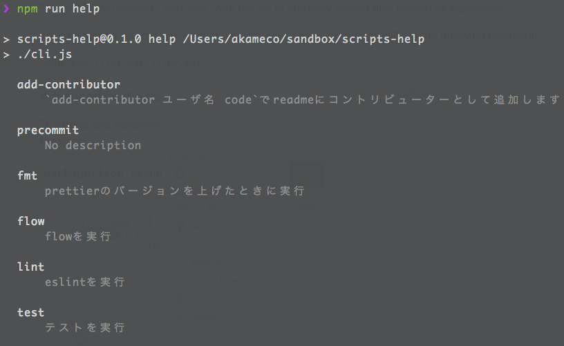

# scripts-help

[](https://travis-ci.org/akameco/scripts-help)
[](https://github.com/facebook/jest)
[](https://github.com/prettier/prettier)
[](#contributors)

> help for npm scripts



## Install

```
$ npm i -g scripts-help
```

## Usage

package.json

```json
{
  "scripts": {
    "start": "...",
    "build": "...",
    "build:dev": "...",
    "help": "npx scripts-help"
  }
}
```

```
npm run help
```

## Locale

`.scripts-help.ja.json`

```json
{
  "start": "アプリケーションを実行します。先にbuildを実行してください",
  "build": "ビルドを実行",
  "build:dev": "dev環境向けにビルドを実行",
  "help": "ヘルプを表示"
}
```

## Create

create `.scripts-help.json` from `package.json`.

```
npm run help --create
```

## Contributors

Thanks goes to these wonderful people ([emoji key](https://github.com/kentcdodds/all-contributors#emoji-key)):

<!-- ALL-CONTRIBUTORS-LIST:START - Do not remove or modify this section -->
<!-- prettier-ignore -->
| [<br /><sub>akameco</sub>](http://akameco.github.io)<br />[💻](https://github.com/akameco/scripts-help/commits?author=akameco "Code") [📖](https://github.com/akameco/scripts-help/commits?author=akameco "Documentation") [⚠️](https://github.com/akameco/scripts-help/commits?author=akameco "Tests") [🚇](#infra-akameco "Infrastructure (Hosting, Build-Tools, etc)") |
| :---: |

<!-- ALL-CONTRIBUTORS-LIST:END -->

This project follows the [all-contributors](https://github.com/kentcdodds/all-contributors) specification. Contributions of any kind welcome!

## License

MIT © [akameco](http://akameco.github.io)
